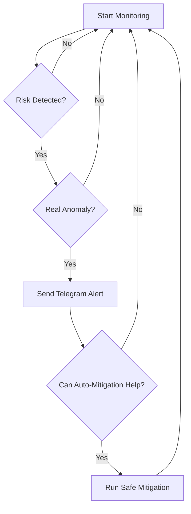

# 🛡️ Validator-AI Monitor

An AI-powered self-monitoring agent designed to predict, analyze, and mitigate risks that could cause missed blocks for validator nodes.

---

## 📋 What This Bot Does

- Collects live system metrics (CPU load, memory, disk IO, network errors) using Prometheus  
- Predicts probability of system failure using a trained machine learning model (Gradient Boosted Trees)  
- Detects real anomalies (high CPU, low memory, high IO, etc.)  
- Automatically mitigates issues safely when possible (e.g., clearing memory cache)  
- Sends real-time Telegram alerts if a critical threshold is crossed  
- Retrains itself over time based on collected real-world data  
- Runs as a lightweight daemon without interfering with your validator performance  

---

## 🚀 How to Run It

### 1. Clone the repository

```bash
git clone https://github.com/GlibxNodes/GlibxNodesAIBot.git
cd GlibxNodesAIBot
```

### 2. Install Python Dependencies

```bash
pip install -r requirements.txt
```

> _requirements.txt contains:_  
> `prometheus-api-client`, `scikit-learn`, `pandas`, `python-dotenv`, `requests`, `joblib`

### 3. Create a `.env` file

Create a `.env` file in the root directory:

```bash
PROMETHEUS_URL=http://localhost:9090
TELEGRAM_BOT_TOKEN=your-telegram-bot-token
TELEGRAM_CHAT_ID=your-chat-id
```

📌 **Notes**:
- Get your Telegram Bot Token from [@BotFather](https://t.me/BotFather)
- Find your Chat ID from [@userinfobot](https://t.me/userinfobot)

---

### 4. Run the Bot

To run manually:

```bash
python3 validator-ai.py
```

Or run as a systemd service:

```bash
sudo systemctl start validator-ai
sudo systemctl enable validator-ai
```

---

## ⚙️ Monitored Metrics

| Metric                                | Purpose           |
|---------------------------------------|-------------------|
| `node_load1`                          | CPU system load   |
| `node_memory_MemAvailable_bytes`      | Free memory       |
| `node_disk_io_time_seconds_total`     | Disk I/O pressure |
| `node_network_receive_errs_total`     | Network errors    |

---

## 🔥 Alert Conditions

- CPU load > 5.0 (sustained)
- Available memory < 1GB
- Disk I/O overload
- Rising network errors
- AI-detected anomalies

---

## 🛡️ Automatic Mitigations

- Memory cache clearing (`sync; echo 3 > /proc/sys/vm/drop_caches`)
- Process priority adjustment
- Zombie process cleanup (future planned)

---

## 💬 Telegram Alerts Include

- ✅ Current system metrics snapshot  
- ⚠️ Detected primary issue  
- 🛠️ Suggested recommended actions  
- 🔧 Mitigations applied (if any)  

---

## ❗ Important Notes

- Only safe, read-only system interventions (no validator force restarts)  
- Minimal resource usage (~30MB RAM)  
- Self-learning model that improves over time  
- Always fallback to safe prediction mode if needed  

---

## 📈 Roadmap




---

## 🏁 Stay online. Slash downtime. Let AI watch your validator.


